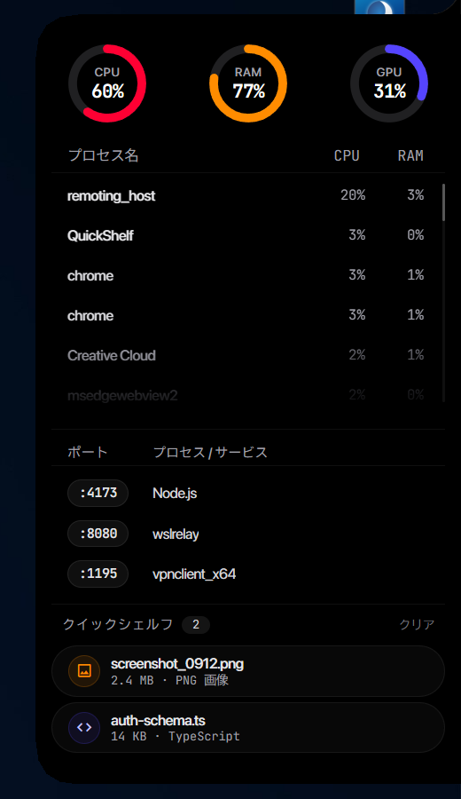
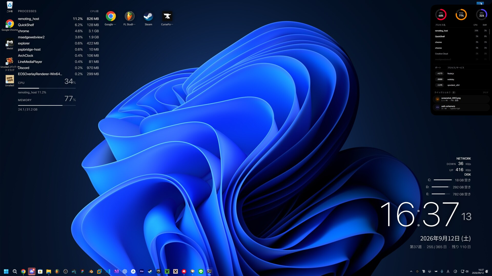

# QuickShelf

<p align="center">
  
</p>

A compact Windows edge shelf for live system monitoring, local development ports, and temporary file staging.

[日本語](README.ja.md)



## Features

- Right-edge hover shelf with native reveal/collapse animation
- Live CPU, RAM, and NVIDIA GPU usage
- Scrollable live process list with per-process CPU/RAM usage
- One-click `Taskkill` for processes
- Listening TCP port list with localhost open action and process termination
- Quick Shelf for temporarily staging files
- Drag files from Quick Shelf directly into Explorer, Discord, browsers, editors, DAWs, and other apps using native Windows file drag-and-drop
- System tray icon with Show / Exit actions
- Japanese and English UI, selected automatically from the system language
- Optional install script that adds QuickShelf to the Start menu and Windows Startup

## Screenshot



## Download

The easiest way to try QuickShelf is the self-contained Windows x64 build from [GitHub Releases](https://github.com/nisesimadao/QuickShelf/releases). The release ZIP includes the .NET runtime, so you do **not** need to install .NET 10 separately. Microsoft Edge WebView2 Runtime is still required (included with current Windows 11 installations).
## Requirements

- Windows 10 version 2004 or later, or Windows 11
- .NET 10 Desktop Runtime
- Microsoft Edge WebView2 Runtime
- NVIDIA GPU + `nvidia-smi` for GPU telemetry; CPU/RAM/process/port features work without it

## Build

```powershell
dotnet restore
dotnet build .\QuickShelf.csproj -c Release
```

To create the publish folder used by the installer:

```powershell
powershell -ExecutionPolicy Bypass -File .\scripts\publish.ps1
```

Output is written to `artifacts\publish`.

## Install

After publishing:

```powershell
powershell -ExecutionPolicy Bypass -File .\scripts\install.ps1
```

QuickShelf is installed to:

```text
%LOCALAPPDATA%\Programs\QuickShelf
```

The installer creates Start menu and Startup shortcuts, then launches QuickShelf.

To uninstall:

```powershell
powershell -ExecutionPolicy Bypass -File .\scripts\uninstall.ps1
```

## Usage

Move the pointer to the right-edge trigger area to reveal QuickShelf. Moving away collapses it into an almost invisible edge target. The larger hidden hit area keeps the shelf easy to reopen without leaving a visible tab on screen.

The process list updates once per second. Hover a process row to reveal `Taskkill`. The list is scrollable and keeps its scroll position while data refreshes.

In Quick Shelf, click **Add** to stage files. Click a staged file to open it, or drag it out of QuickShelf to another application as a normal Windows file drop.

## Architecture

QuickShelf uses a native WPF host for the edge geometry, window region, animation, system integration, tray icon, and file drag-and-drop. The inner interface is rendered with WebView2. System statistics and process/port data are collected in C# and pushed into the WebView as JSON.

## Notes

`Taskkill` immediately terminates the selected process tree. Use it with care for apps containing unsaved work.

