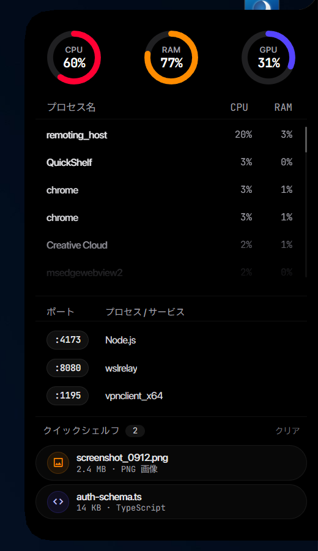
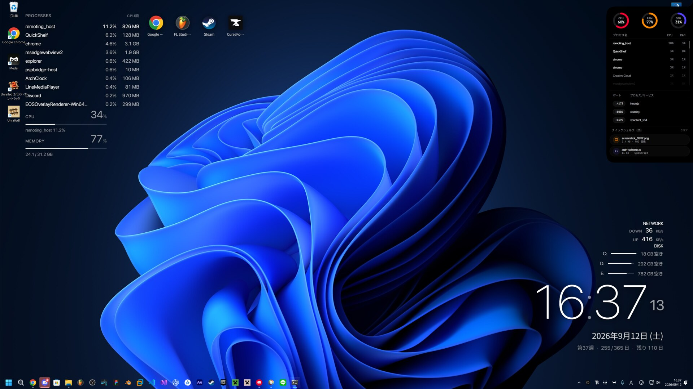

# QuickShelf

<p align="center">
  
</p>

QuickShelf is a Windows edge panel that combines live system monitoring, local development port inspection, and temporary file staging.

[日本語](README.ja.md)



## Features

- Reveal the panel by moving the pointer to the right edge of the screen.
- Monitor CPU, RAM, and NVIDIA GPU usage in real time.
- View a scrollable process list with per-process CPU and RAM usage.
- Terminate a process tree with `Taskkill` from its row.
- View listening TCP ports, open localhost endpoints, and terminate the owning process.
- Temporarily stage files in Quick Shelf.
- Drag staged files into Explorer, Discord, browsers, editors, DAWs, and other applications through native Windows file drag-and-drop.
- Control Show and Exit actions from the system tray.
- Use Japanese or English UI based on the Windows display language.
- Optionally install a Start menu shortcut and per-user scheduled logon task.

## Screenshot



## Download

The self-contained Windows x64 build is available from [GitHub Releases](https://github.com/nisesimadao/QuickShelf/releases).
The release ZIP includes the .NET runtime, so .NET 10 does not need to be installed separately.
Microsoft Edge WebView2 Runtime is still required and is normally included with current Windows 11 installations.

## Requirements

- Windows 10 version 2004 or later, or Windows 11.
- Microsoft Edge WebView2 Runtime.
- .NET 10 Desktop Runtime when running a non-self-contained build from source.
- NVIDIA GPU and `nvidia-smi` for GPU telemetry.
  CPU, RAM, process, and port features work without an NVIDIA GPU.

## Build

```powershell
dotnet restore
dotnet build .\QuickShelf.csproj -c Release
```

To create the publish directory used by the installer:

```powershell
powershell -ExecutionPolicy Bypass -File .\scripts\publish.ps1
```

The output is written to `artifacts\publish`.

## Install

After publishing, run:

```powershell
powershell -ExecutionPolicy Bypass -File .\scripts\install.ps1
```

QuickShelf is installed to:

```text
%LOCALAPPDATA%\Programs\QuickShelf
```

The installer creates a Start menu shortcut and registers a per-user scheduled task that starts QuickShelf 10 seconds after logon.
It then launches QuickShelf.

To uninstall:

```powershell
powershell -ExecutionPolicy Bypass -File .\scripts\uninstall.ps1
```

## Usage

Move the pointer into the right-edge trigger area to reveal QuickShelf.
Moving away collapses it into an almost invisible edge target.
The hit area is larger than the visible target so the panel remains easy to reopen.

The process list updates once per second.
Hover a process row to reveal `Taskkill`.
The list remains scrollable and preserves its scroll position while data refreshes.

In Quick Shelf, click **Add** to stage a file.
Click a staged file to open it, or drag it to another application as a normal Windows file drop.

## Architecture

QuickShelf uses a WPF host for edge geometry, window regions, animation, system integration, the tray icon, and file drag-and-drop.
The inner interface is rendered with WebView2.
C# collects system statistics and process or port data, then sends the data to the WebView as JSON.

## Notes

`Taskkill` immediately terminates the selected process tree.
Do not use it on an application with unsaved work unless you intend to terminate that application.
